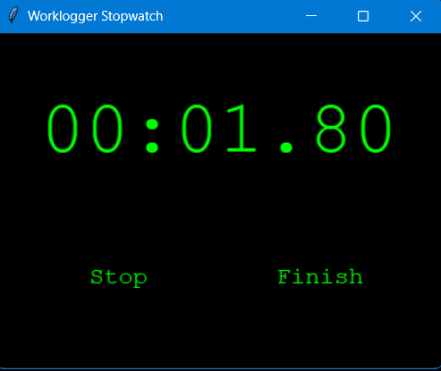
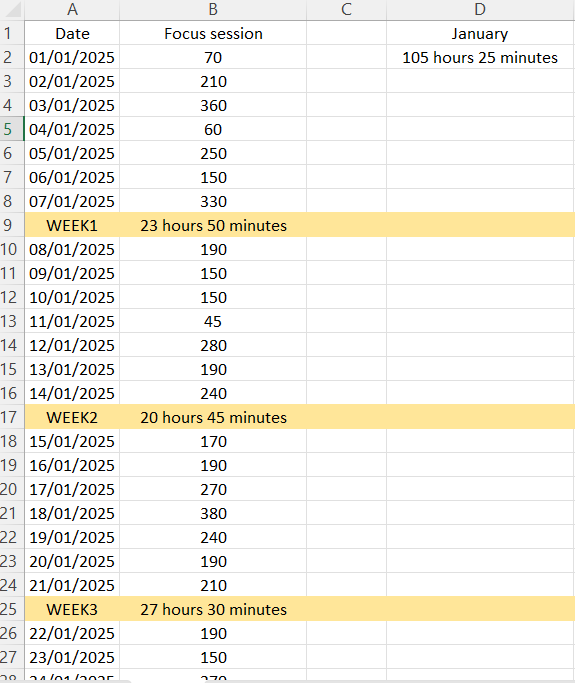

# Worklogger Stopwatch

Worklogger Stopwatch is a Python-based application designed to help you effectively track the time spent on various tasks. It features a user-friendly interface built with Tkinter and logs time data into an Excel file for easy tracking and reference.

## Features

- **Start and Stop Stopwatch**: Effortlessly track your time with a convenient start/stop button.
- **Time Display**: Displays elapsed time in minutes, seconds, and hundredths of a second, with a focus on total time registered in minutes.
- **Excel Logging**: Automatically records time data into an Excel file (`Worklogs.xlsx`) stored in your iCloud Drive for seamless access. **Please modify the path to the Excel file in the code before using.**
- **Daily Tracking**: Updates the Excel file with today's date and the total time spent on tasks, ensuring accurate daily records.
- **User-Friendly Interface**: A simple and intuitive UI built with Tkinter, designed for ease of use.

## Requirements

- Python 3.x
- `openpyxl` library for working with Excel files
- Tkinter (usually comes pre-installed with Python)

To install the required libraries, run:
